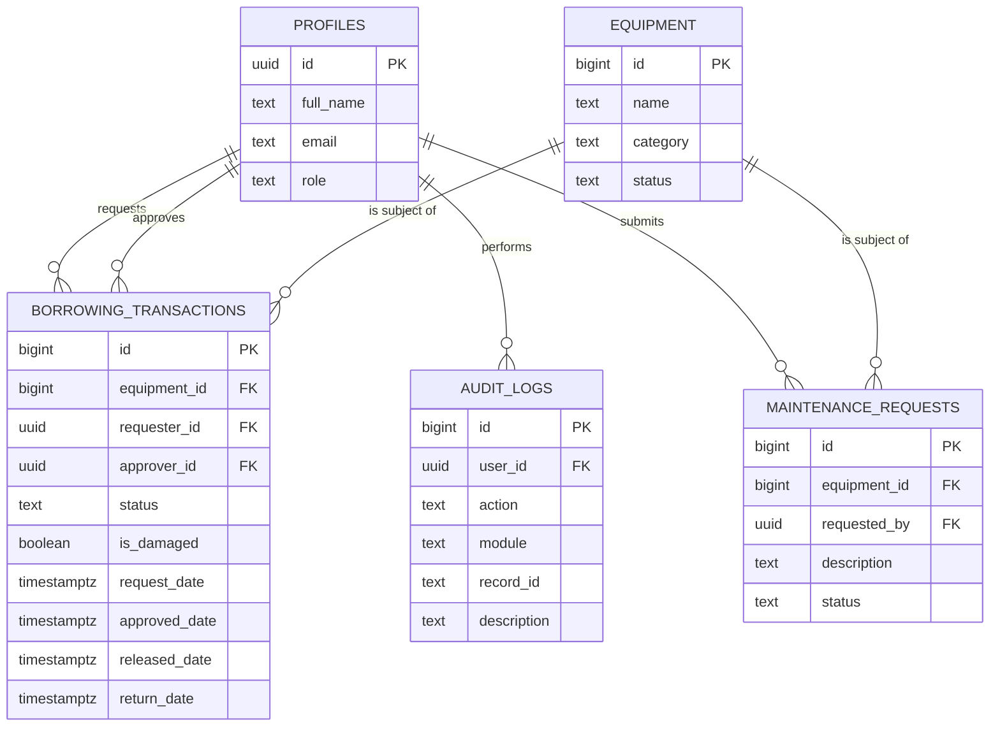
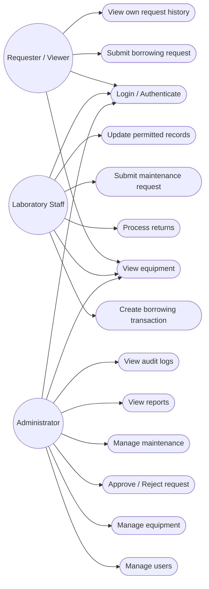
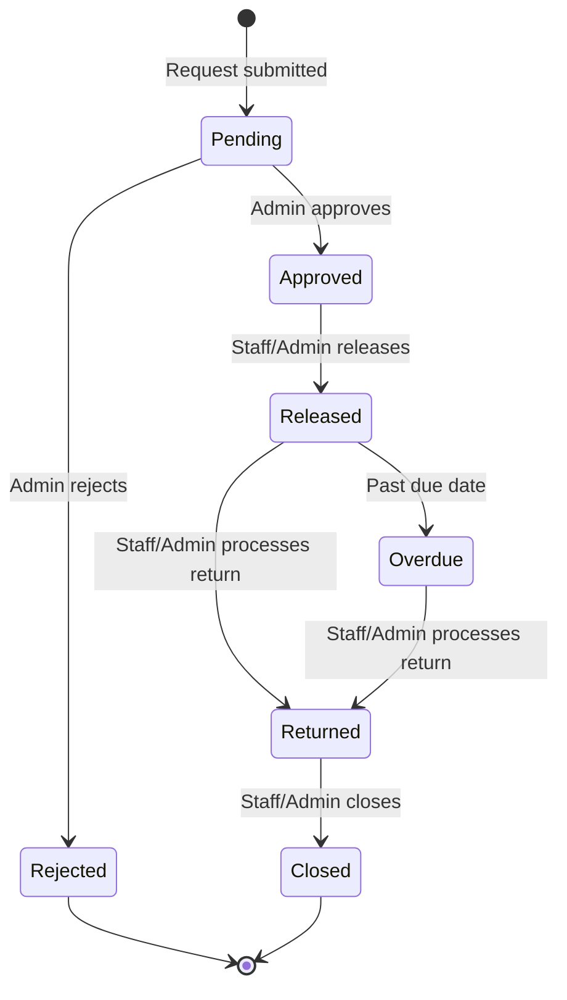

# Role-Based Asset Transaction and Approval Management
Systems Analysis and Design — Laboratory 4, Section A

A static frontend (HTML/CSS/JS, deployable on GitHub Pages) backed by **Supabase**
(Postgres + Auth), adding role-based access control, a borrowing approval workflow,
business-rule enforcement, and an audit trail on top of the existing Laboratory
Asset and Service Management System.

## 1. Roles

| Role | Permitted Functions |
|---|---|
| **Administrator** | Manage users and equipment; approve/reject requests; manage maintenance; view reports and audit logs |
| **Laboratory Staff** | View equipment; create borrowing transactions; process returns; submit maintenance requests; update permitted records |
| **Requester / Viewer** | View available equipment; submit borrowing requests; view own request status and history |

## 2. Setup

### 2.1 Create the Supabase backend
1. Create a free project at [supabase.com](https://supabase.com).
2. Open **SQL Editor** and run the entire contents of [`supabase/schema.sql`](supabase/schema.sql).
   This creates all tables, Row-Level Security policies, and the triggers that
   enforce every business rule and write the audit trail.
3. Go to **Project Settings → API** and copy your **Project URL** and **anon public key**.

### 2.2 Configure the frontend
Edit [`js/config.js`](js/config.js):
```js
const SUPABASE_URL = "https://YOUR-PROJECT-REF.supabase.co";
const SUPABASE_ANON_KEY = "YOUR-ANON-PUBLIC-KEY";
```

### 2.3 Create your first users
1. Open the site, click **"New here? Create an account"**, and sign up 2–3 test accounts
   (e.g. one to become Admin, one Staff, one Requester). New accounts default to `requester`.
2. In Supabase → **Table Editor → profiles**, change the `role` column for your admin/staff
   test accounts (or run in SQL Editor):
   ```sql
   update public.profiles set role = 'admin' where email = 'admin@example.com';
   update public.profiles set role = 'staff' where email = 'staff@example.com';
   ```

### 2.4 Run locally
Just open `index.html` in a browser, or serve the folder with any static server:
```bash
python3 -m http.server 8000
```

### 2.5 Deploy to GitHub Pages
```bash
git init
git add .
git commit -m "Lab 4-A: role-based asset transaction and approval management"
git branch -M main
git remote add origin https://github.com/<your-username>/<your-repo>.git
git push -u origin main
```
Then in the repo: **Settings → Pages → Source: `main` branch, `/ (root)`** → Save.
Your live URL will be `https://<your-username>.github.io/<your-repo>/`.

## 3. Entity-Relationship Diagram



## 4. Use Case Diagram



## 5. Borrowing Approval Workflow



## 6. Role-Permission Matrix

| Function | Administrator | Laboratory Staff | Requester / Viewer |
|---|:---:|:---:|:---:|
| View available equipment | ✅ | ✅ | ✅ |
| Add / edit / delete equipment | ✅ | ❌ | ❌ |
| Submit borrowing request | ✅ | ✅ | ✅ (own only) |
| View own request history | ✅ | ✅ (all) | ✅ (own only) |
| Approve / reject request | ✅ | ❌ | ❌ |
| Release approved equipment | ✅ | ✅ | ❌ |
| Process returns | ✅ | ✅ | ❌ |
| Submit maintenance request | ✅ | ✅ | ❌ |
| Resolve maintenance request | ✅ | ❌ | ❌ |
| Manage users / roles | ✅ | ❌ | ❌ |
| View audit logs | ✅ | ❌ | ❌ |

Enforced twice: in the UI (sidebar links + disabled/hidden actions) **and** in the
database (RLS policies + trigger checks in `schema.sql`), so a user cannot bypass
the rule by calling the API directly.

## 7. Business Rules

| ID | Rule | Where enforced |
|---|---|---|
| BR-A4-01 | Only Available equipment may be requested | `enforce_new_request()` trigger |
| BR-A4-02 | Staff/Admin cannot approve their own request | `enforce_borrowing_rules()` trigger |
| BR-A4-03 | Only Administrator may approve or reject requests | `enforce_borrowing_rules()` + RLS |
| BR-A4-04 | Only Approved requests may be released | `enforce_borrowing_rules()` trigger |
| BR-A4-05 | Released equipment becomes Borrowed | `enforce_borrowing_rules()` trigger |
| BR-A4-06 | Returned equipment becomes Available unless damaged | `enforce_borrowing_rules()` trigger |
| BR-A4-07 | Rejected requests cannot be released | Guaranteed by BR-A4-04 (Released requires prior status = Approved) |
| BR-A4-08 | Returned transactions cannot be processed twice | `enforce_borrowing_rules()` trigger (requires prior status = Released) |
| BR-A4-09 | Equipment under Maintenance cannot be borrowed | `enforce_new_request()` trigger |
| BR-A4-10 | Sensitive operations must be logged | `log_borrowing_audit()`, `log_equipment_audit()`, `log_maintenance_audit()`, `log_role_change_audit()` triggers |

## 8. Audit Trail

`audit_logs(id, user_id, action, module, record_id, description, created_at)` is
populated automatically by `SECURITY DEFINER` triggers whenever a sensitive action
occurs (request submitted/approved/rejected/released/returned/closed, equipment
added/updated/deleted, maintenance opened/resolved, role changed). Regular users
have **no** insert/update/delete privilege on this table — only the Administrator
can even read it — so the trail cannot be tampered with from the application layer.

## 9. Functional Testing

See `docs/test_results.md` for the TC-A4-01 … TC-A4-10 checklist (fill in Pass/Fail
after you run each scenario against your own deployed instance) and instructions
there for capturing your Audit Log screenshot for submission.

## 10. Project Structure
```
├── index.html                 # single-page app (auth + role-based views)
├── css/style.css
├── js/config.js               # <- put your Supabase URL/anon key here
├── js/app.js                  # all auth + view logic
├── supabase/schema.sql        # tables, RLS policies, business-rule triggers, audit trail
└── docs/                      # diagrams, matrix, business rules, test results
```
