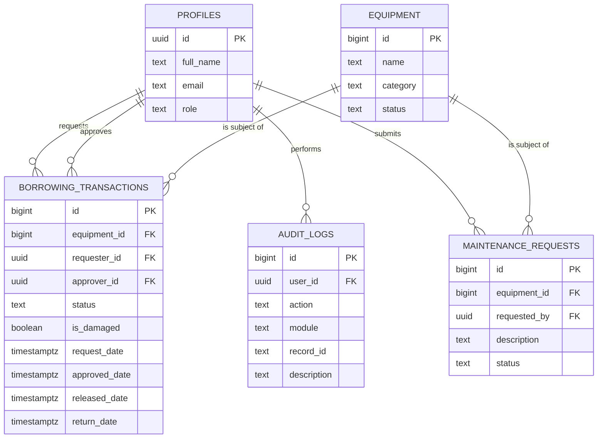
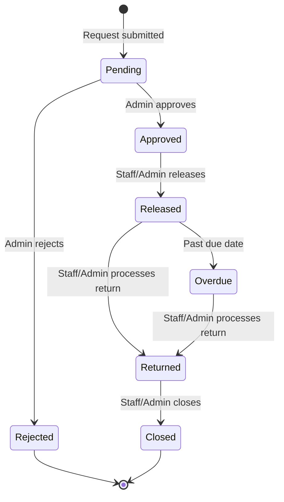
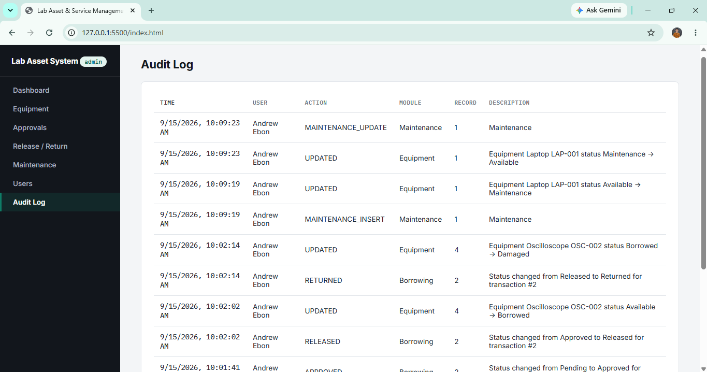

# Role-Based Asset Transaction and Approval Management
Systems Analysis and Design — Laboratory 4, Section A

A static frontend (HTML/CSS/JS, deployed on GitHub Pages) backed by **Supabase**
(Postgres + Auth), adding role-based access control, a borrowing approval workflow,
business-rule enforcement, and an audit trail on top of the existing Laboratory
Asset and Service Management System.

## User Roles

| Role | Permitted Functions |
|---|---|
| **Administrator** | Manage users and equipment; approve/reject requests; manage maintenance; view reports and audit logs |
| **Laboratory Staff** | View equipment; create borrowing transactions; process returns; submit maintenance requests; update permitted records |
| **Requester / Viewer** | View available equipment; submit borrowing requests; view own request status and history |

---

## 1. GitHub Repository URL
https://github.com/Frich10/SAD-Lab4-RoleBased-Asset-Management

## 2. Live GitHub Pages URL
https://frich10.github.io/SAD-Lab4-RoleBased-Asset-Management/

## 3. Updated ERD and Use Case Diagram

### Entity-Relationship Diagram

### Use Case Diagram

PNG versions of both diagrams are in [`docs/erd.png`](docs/erd.png) and
[`docs/use_case.png`](docs/use_case.png).

## 4. Role-Permission Matrix

| Function | Administrator | Laboratory Staff | Requester / Viewer |
|---|:---:|:---:|:---:|
| View available equipment | ✅ | ✅ | ✅ |
| Add / edit / delete equipment | ✅ | ❌ | ❌ |
| Submit borrowing request | ✅ | ✅ | ✅ (own only) |
| View own request history | ✅ | ✅ (all) | ✅ (own only) |
| Approve / reject request | ✅ | ❌ | ❌ |
| Release approved equipment | ✅ | ✅ | ❌ |
| Process returns | ✅ | ✅ | ❌ |
| Submit maintenance request | ✅ | ✅ | ❌ |
| Resolve maintenance request | ✅ | ❌ | ❌ |
| Manage users / roles | ✅ | ❌ | ❌ |
| View audit logs | ✅ | ❌ | ❌ |

Enforced twice: in the UI (sidebar links + disabled/hidden actions) **and** in the
database (RLS policies + trigger checks in `supabase/schema.sql`), so a user cannot
bypass the rule by calling the API directly.

## 5. Workflow Diagram

PNG version: [`docs/workflow.png`](docs/workflow.png).

## 6. Business Rules

| ID | Rule | Where enforced |
|---|---|---|
| BR-A4-01 | Only Available equipment may be requested | `enforce_new_request()` trigger |
| BR-A4-02 | Staff/Admin cannot approve their own request | `enforce_borrowing_rules()` trigger |
| BR-A4-03 | Only Administrator may approve or reject requests | `enforce_borrowing_rules()` + RLS |
| BR-A4-04 | Only Approved requests may be released | `enforce_borrowing_rules()` trigger |
| BR-A4-05 | Released equipment becomes Borrowed | `enforce_borrowing_rules()` trigger |
| BR-A4-06 | Returned equipment becomes Available unless damaged | `enforce_borrowing_rules()` trigger |
| BR-A4-07 | Rejected requests cannot be released | Guaranteed by BR-A4-04 (Released requires prior status = Approved) |
| BR-A4-08 | Returned transactions cannot be processed twice | `enforce_borrowing_rules()` trigger (requires prior status = Released) |
| BR-A4-09 | Equipment under Maintenance cannot be borrowed | `enforce_new_request()` trigger |
| BR-A4-10 | Sensitive operations must be logged | `log_borrowing_audit()`, `log_equipment_audit()`, `log_maintenance_audit()`, `log_role_change_audit()` triggers |

## 7. Audit-Log Screenshot

`audit_logs(id, user_id, action, module, record_id, description, created_at)` is
populated automatically by `SECURITY DEFINER` triggers whenever a sensitive action
occurs (request submitted/approved/rejected/released/returned/closed, equipment
added/updated/deleted, maintenance opened/resolved, role changed). Regular users
have **no** insert/update/delete privilege on this table — only the Administrator
can even read it — so the trail cannot be tampered with from the application layer.

Screenshot:

## 8. Functional Test Results

| Test ID | Scenario | Expected Result | Pass/Fail |
|---|---|---|---|
| TC-A4-01 | Viewer attempts to open Admin page | Access denied. | Pass |
| TC-A4-02 | Staff submits request | Request saved as Pending. | Pass |
| TC-A4-03 | Administrator approves request | Status becomes Approved; audit log created. | Pass |
| TC-A4-04 | Administrator rejects request | Status becomes Rejected. | Pass |
| TC-A4-05 | Attempt to release rejected request | Operation blocked. | Pass |
| TC-A4-06 | Release approved equipment | Equipment becomes Borrowed. | Pass |
| TC-A4-07 | Return released equipment | Equipment returns to appropriate status. | Pass |
| TC-A4-08 | Check audit log after approval | Approval entry is visible. | Pass |
| TC-A4-09 | Staff attempts restricted delete | Operation blocked. | Pass |
| TC-A4-10 | Logout and open protected page | Redirected to login / access denied. | Pass |

Full checklist with extra rule-specific checks: [`docs/test_results.md`](docs/test_results.md).
